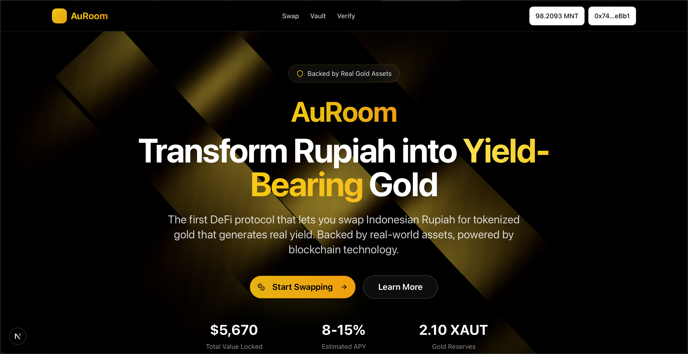
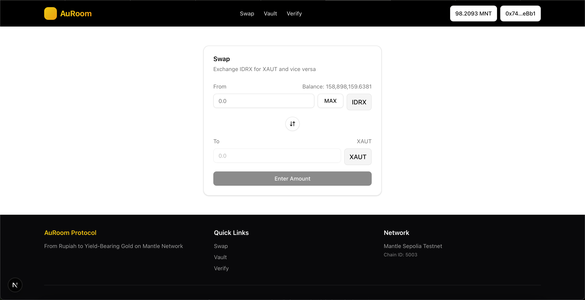
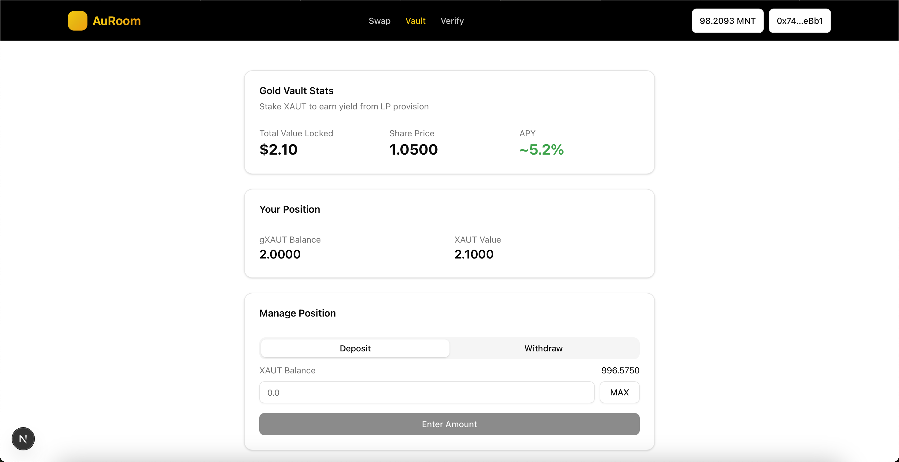
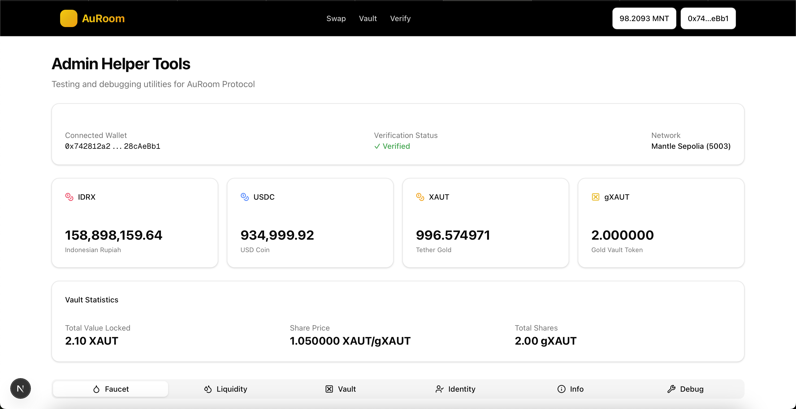

# 🏆 AuRoom Protocol - Frontend

<div align="center">


**From Rupiah to Yield-Bearing Gold**

[](https://nextjs.org/)
[](https://www.typescriptlang.org/)
[](https://wagmi.sh/)
[](https://tailwindcss.com/)
[](./LICENSE)

[🌐 Live Demo](https://auroom-lisk-testnet.vercel.app) • [📜 Smart Contracts](https://github.com/YohanesVito/auroom-lisk-sc) • [🔧 Backend](https://github.com/YohanesVito/auroom-lisk-be) • [📖 Documentation](#-documentation)

</div>

---

## 🌐 Live Demo

**🔗 [https://auroom-lisk-testnet.vercel.app](https://auroom-lisk-testnet.vercel.app)**

> ⚠️ **Testnet Only**: This demo runs on Lisk Sepolia testnet. Do not use real funds.

---

## 📖 Overview

**AuRoom** is a Real World Asset (RWA) protocol on Lisk that enables users to access Indonesian Rupiah (IDRX) liquidity using tokenized gold (XAUT) as collateral, and seamlessly redeem IDRX back to fiat currency through bank transfers.

### Why AuRoom?

```
┌────────────────────────────────────────────────────────────────┐
│                                                                 │
│   REGULAR DEX:                                                  │
│   XAUT ──→ IDRX ──→ 🚀 Sell for cash (off-chain, complex)          │
│                                                                 │
│   AUROOM:                                                        │
│   XAUT ──→ Cash Loan ──→ IDRX ──→ 🏦 Direct bank transfer      │
│                                                                 │
│   "Unlock liquidity from your gold. Instant. On-chain."         │
│                                                                 │
└────────────────────────────────────────────────────────────────┘
```

---

## ✨ Features

### 🏠 Landing Page
- Protocol overview and value proposition
- Live protocol statistics (TVL, share price, APY)
- Educational content about RWA and tokenized gold
- Comparison: AuRoom vs Traditional DEX

### 💰 Cash Loan Page
- Borrow IDRX using XAUT collateral
- Flexible LTV options (30%, 40%, 50%)
- Instant liquidity without selling your gold
- Integrated bank details for redeem

### 📊 My Loans Page
- Track active loans and collateral
- View loan health and liquidation risk
- Repay loans to unlock collateral
- Transaction history

### 💎 IDRX Redeem Flow
- Burn IDRX tokens on-chain
- Direct bank transfer to Indonesian bank accounts
- Support for major banks (BCA, BNI, BRI, Mandiri)
- Real-time status tracking with reference number

### 💱 Swap Page
- Swap IDRX ↔ XAUT ↔ USDC seamlessly
- Real-time quotes from on-chain data
- Slippage protection
- Transaction status tracking

### 🛠️ Admin Page
- **Faucet**: Get test tokens (IDRX, USDC, XAUT)
- **Liquidity**: Add/remove liquidity to pools
- **Vault**: Inject yield for demo purposes
- **Identity**: Manage user verification
- **Debug**: View balances, allowances, contract info

---

## 📸 Screenshots

<details>
<summary>Click to expand screenshots</summary>

### Landing Page


### Swap Page


### Vault Page


### Admin Page


</details>

> 💡 Add your screenshots to a `screenshots/` folder

---

## 🛠️ Tech Stack

### Core
| Technology | Version | Purpose |
|------------|---------|---------|
| Next.js | 16.1.0 | React framework with App Router |
| React | 19.2.3 | UI library |
| TypeScript | 5.x | Type safety |

### Web3
| Technology | Version | Purpose |
|------------|---------|---------|
| wagmi | 2.19.5 | React hooks for Ethereum |
| viem | 2.x | Ethereum interactions |
| RainbowKit | 2.x | Wallet connection UI |
| @tanstack/react-query | 5.x | Data fetching & caching |

### UI/UX
| Technology | Version | Purpose |
|------------|---------|---------|
| Tailwind CSS | 4.x | Utility-first styling |
| Radix UI | Various | Accessible components |
| Lucide React | 0.562.0 | Icons |
| GSAP | 3.14.2 | Animations |
| Three.js | 0.182.0 | 3D graphics |
| Recharts | 2.15.4 | Charts |
| Sonner | 2.0.7 | Toast notifications |

### Utilities
| Technology | Version | Purpose |
|------------|---------|---------|
| BigNumber.js | 9.3.1 | Precise number handling |
| date-fns | 4.1.0 | Date formatting |
| clsx | 2.1.1 | Conditional classes |

---

## 📁 Project Structure

```
auroom-fe/
├── app/                      # Next.js App Router
│   ├── page.tsx              # Landing page
│   ├── layout.tsx            # Root layout
│   ├── globals.css           # Global styles
│   ├── swap/
│   │   └── page.tsx          # Swap page
│   ├── vault/
│   │   └── page.tsx          # Vault page
│   ├── verify/
│   │   └── page.tsx          # Verification page
│   └── admin/
│       └── page.tsx          # Admin helper page
├── components/
│   ├── ui/                   # Reusable UI components
│   ├── layout/               # Layout components
│   ├── landing/              # Landing page sections
│   ├── swap/                 # Swap-related components
│   ├── vault/                # Vault-related components
│   └── admin/                # Admin page components
├── hooks/                    # Custom React hooks
│   ├── useTokenBalance.ts
│   ├── useSwapRouter.ts
│   ├── useGoldVault.ts
│   └── ...
├── lib/
│   ├── contracts/            # Contract addresses & ABIs
│   ├── wagmi.ts              # Wagmi configuration
│   └── utils.ts              # Utility functions
├── providers/                # React context providers
├── types/                    # TypeScript types
└── public/                   # Static assets
```

---

## 🚀 Getting Started

### Prerequisites

- Node.js 20.x or later
- npm / yarn / pnpm

### Installation

```bash
# Clone the repository
git clone https://github.com/YohanesVito/auroom-fe.git
cd auroom-fe

# Install dependencies
npm install
# or
yarn install
# or
pnpm install

# Run development server
npm run dev
```

Open [http://localhost:3000](http://localhost:3000) in your browser.

### Environment Variables

Create a `.env.local` file:

```env
# WalletConnect Project ID (get from https://cloud.walletconnect.com)
NEXT_PUBLIC_WALLETCONNECT_PROJECT_ID=your_project_id

# Lisk Sepolia RPC (Optional: Custom RPC URL)
NEXT_PUBLIC_LISK_SEPOLIA_RPC=https://rpc.sepolia-api.lisk.com

# IDRX API Configuration
IDRX_API_BASE_URL=https://api.idrx.org
IDRX_API_KEY=your_api_key_here
IDRX_MODE=demo  # Use 'demo' for testing, 'production' for real API
```

---

## 📜 Contract Addresses

All contracts are deployed on **Lisk Sepolia Testnet** (Chain ID: 4202)

| Contract | Address |
|----------|---------|
| **Tokens** | |
| IDRX | `0xe0f7ea8fb1a7e9e9f8838d0e24b7a0f750c68d40` |
| USDC | `0xA8F2b8180caFC670f4a24114FDB9c50361038857` |
| XAUT (Gold) | `0xDb198BEaccC55934062Be9AAEdce332c40A1f1Ed` |
| **Infrastructure** | |
| IdentityRegistry | `0x799fe52FA871EB8e4420fEc9d1b81c6297e712a5` |
| UniswapV2Factory | `0x96abff3a2668b811371d7d763f06b3832cedf38d` |
| UniswapV2Router | `0x6036306f417d720228ab939650e8acbe948d2d2b` |
| **Liquidity Pairs** | |
| IDRX/USDC Pair | `0xB0ea91604C8B98205cbDd5c3F7d8DB006404515F` |
| XAUT/USDC Pair | `0xBdfD81D4e79c0cC949BB52941BCd30Ed8b3B4112` |
| **Core Protocol** | |
| SwapRouter | `0x8cDE80170b877a51a17323628BA6221F6F023505` |
| BorrowingProtocolV2 | `0x8c49cF7B7CCE0fBffADFe44F764fe6c5F2df82F9` |

> 💡 **Block Explorer**: [Lisk Sepolia Blockscout](https://sepolia-blockscout.lisk.com)

---

## 🎮 How to Use

### 1. Connect Wallet

1. Click "Connect Wallet" button
2. Select your preferred wallet (MetaMask, Coinbase, etc.)
3. Switch to Lisk Sepolia network if prompted

### 2. Get Test Tokens

1. Go to [Admin Page](https://auroom-lisk-testnet.vercel.app/admin)
2. Use the Faucet tab to mint test tokens:
   - IDRX (Indonesian Rupiah)
   - USDC
   - XAUT (Gold - requires verification)

### 3. Get Verified (Demo KYC)

1. Visit [Demo KYC Page](https://auroom-lisk-testnet.vercel.app/demo-kyc)
2. Enter your wallet address
3. Submit for verification
4. Admin will approve (or self-approve in admin page)

### 4. Get a Cash Loan

1. Go to [Cash Loan Page](https://auroom-lisk-testnet.vercel.app/cash-loan)
2. Enter desired loan amount in IDRX
3. Select LTV (30%, 40%, or 50%)
4. Review collateral required (in XAUT)
5. Approve XAUT if needed
6. Click "Borrow" and confirm transaction
7. Receive IDRX tokens instantly!

### 5. Enter Bank Details for Redeem

1. After borrowing, enter your Indonesian bank details:
   - Select bank (BCA, BNI, BRI, Mandiri)
   - Enter 10-12 digit account number
   - Enter account holder name
2. Click "Submit & Redeem"

### 6. Redeem IDRX to Bank Account

1. System burns your IDRX tokens on-chain
2. Redeem request sent to IDRX API
3. Receive customer reference number
4. IDR will be transferred to your bank account (1-2 business days)

### 7. Track Your Loans

1. Go to [My Loans Page](https://auroom-lisk-testnet.vercel.app/my-loans)
2. View all active loans
3. Monitor collateral and health factor
4. Repay loans to unlock your XAUT collateral

### 8. Swap Tokens (Optional)

1. Go to [Swap Page](https://auroom-lisk-testnet.vercel.app/swap)
2. Select tokens to swap (IDRX, USDC, XAUT)
3. Enter amount
4. Review quote and slippage
5. Click "Swap" and confirm

---

## 🧪 Development

### Scripts

```bash
# Development server
npm run dev

# Production build
npm run build

# Start production server
npm run start

# Lint code
npm run lint
```

### Code Style

- ESLint for linting
- Prettier for formatting (recommended)
- TypeScript strict mode enabled

---

## 🚢 Deployment

### Vercel (Recommended)

1. Push code to GitHub
2. Import project in [Vercel](https://vercel.com)
3. Add environment variables
4. Deploy!

### Manual Deployment

```bash
# Build for production
npm run build

# The output is in .next folder
# Deploy to your hosting provider
```

---

## 🔐 Security Notes

- ⚠️ **Testnet Only**: This is a demo on Lisk Sepolia
- ⚠️ **No Real Funds**: All tokens are mock/test tokens
- ⚠️ **KYC Required**: Users must be verified to use XAUT
- ⚠️ **Demo Mode**: IDRX redeem uses mock API by default
- ✅ **Non-Custodial**: You always control your keys
- ✅ **On-Chain Verification**: All burns are recorded on blockchain
- ✅ **Slippage Protection**: Built into all swaps

---

## 🗺️ Roadmap

- [x] Landing page with protocol info
- [x] Swap functionality (IDRX ↔ XAUT ↔ USDC)
- [x] Cash Loan with collateral (BorrowingProtocolV2)
- [x] IDRX Redeem to bank accounts
- [x] My Loans tracking page
- [x] Admin helper tools
- [x] Demo mode for testing
- [x] Live protocol statistics
- [ ] Real IDRX API integration (production mode)
- [ ] Transaction history improvements
- [ ] Dark/light mode toggle
- [ ] Mobile app (React Native)
- [ ] Mainnet deployment on Lisk

---

## 🤝 Contributing

Contributions are welcome!

1. Fork the repository
2. Create your feature branch (`git checkout -b feature/AmazingFeature`)
3. Commit your changes (`git commit -m 'Add some AmazingFeature'`)
4. Push to the branch (`git push origin feature/AmazingFeature`)
5. Open a Pull Request

---

## 📄 License

This project is licensed under the MIT License - see the [LICENSE](LICENSE) file for details.

---

## 🙏 Acknowledgments

- **Lisk** - L2 Blockchain Infrastructure
- **IDRX.org** - Indonesian Rupiah stablecoin provider
- **RainbowKit** - Beautiful wallet connection
- **wagmi** - Excellent React hooks for Ethereum
- **Vercel** - Hosting platform
- **shadcn/ui** - UI component inspiration

---

## 📬 Contact

**Apple Bites** - [@YohanesVito](https://github.com/YohanesVito)

- 🌐 Live Demo: [https://auroom-lisk-testnet.vercel.app](https://auroom-lisk-testnet.vercel.app)
- 📜 Smart Contracts: [auroom-lisk-sc](https://github.com/YohanesVito/auroom-lisk-sc)
- 🔧 Backend API: [auroom-lisk-be](https://github.com/YohanesVito/auroom-lisk-be)
- 🐛 Issues: [GitHub Issues](https://github.com/YohanesVito/auroom-lisk-fe/issues)

---

<div align="center">

**Built with ❤️ for Lisk Builders Challenge: Round Three**

[⬆ Back to Top](#-auroom-protocol---frontend)

</div>
